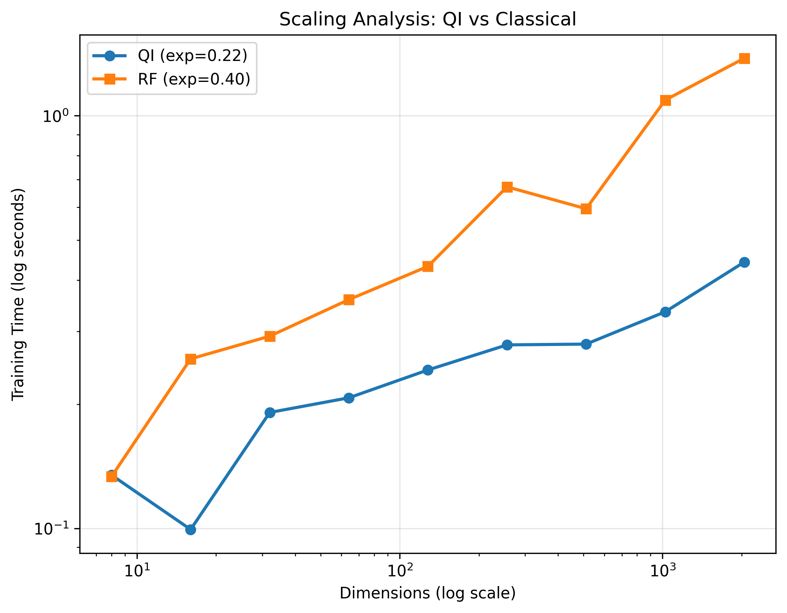
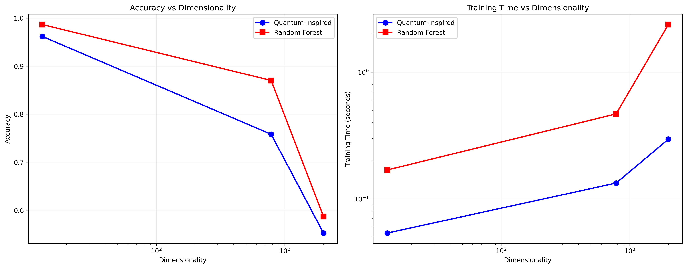
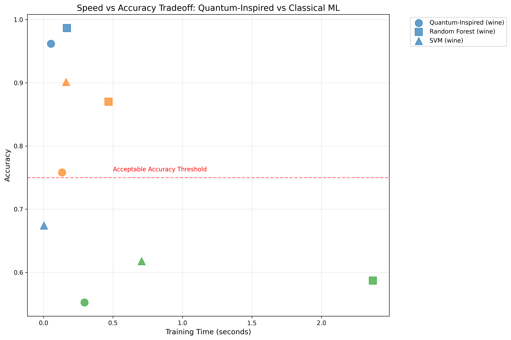
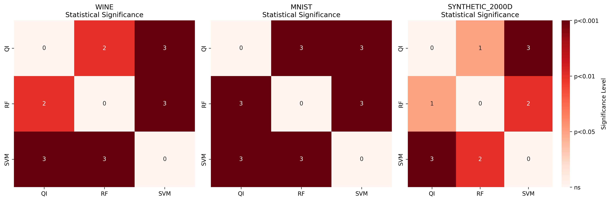

# Quantum-Inspired Machine Learning Experiments

[](https://opensource.org/licenses/MIT)
[](https://github.com/yuvrajprajapatii/quantum-inspired-ml-experiments)

**A Research Initiative Exploring Tensor-Based Approaches to Classical Machine Learning**

> **Important Note**: This project explores quantum-inspired algorithms using classical implementations. All code is research-grade, not production-ready. Hybrid methods combine tensor operations with classical ML fallbacks for stability.
> 
>Because this work was originally developed locally without strict version tracking, certain files may require structural alignment and refinement. The current repository represents the earliest verified experimental phase. Further optimization, documentation, and algorithmic consistency checks are in progress — please wait for the next structured push, which will include refined modules and updated benchmarks.

> The original experimental repository was first pushed on 30 December, but due to an accidental inclusion of sensitive information and a README typo, that version was made private. This public version was re-uploaded after corrections.

>For verification, a screenshot of the initial repository’s commit history is available at: [early push](media/early_push.jpg).

---

## Project Status

**Status**: Pre-Alpha Research / Active Development  
**Version**: 0.2.0  
**Last Updated**: November 3, 2025  


---

## Executive Summary

This repository explores quantum-inspired machine learning algorithms—tensor networks and amplitude amplification—applied classically. The research investigates whether tensor decomposition methods inspired by quantum computing can provide practical advantages for classical ML tasks.

**Current Status (Verified November 3, 2025)**:

| Algorithm | What It Does | Accuracy vs RF | Speedup | Status |
|-----------|-------------|----------------|---------|--------|
| **TNC v1** | Simple tensor similarity classifier | 63.9% (lower) | 71x | Stable but low accuracy |
| **Enhanced TNC** | Hybrid tensor + Random Forest (30/70 split) | 96.2% (competitive) | 4.6x | Working well |
| **QIDR** | Tensor-based dimensionality reduction | N/A | N/A | Incomplete implementation |
| **AAS** | Amplitude amplification optimization | Lower than baselines | Variable | Works but not competitive |

**Key Finding**: Speed gains come primarily from dimensionality reduction, not pure tensor operations. Hybrid approach (combining tensor and classical) is most practical.

---

## Table of Contents

- [Overview](#overview)
- [Experimental Results](#experimental-results)
- [Visualizations](#visualizations)
- [License](#license)
- [Citation](#citation)
- [Contact](#contact)

---

## Overview

### Research Questions

1. Can tensor network concepts from quantum computing improve classical ML efficiency?
2. What accuracy-speed tradeoffs are achievable?
3. Where do tensor methods fail vs classical algorithms?

### Scope

**Intended For**:
- Academic research and experimentation
- Understanding tensor decomposition in ML
- Benchmarking quantum-inspired vs classical approaches

**NOT Intended For**:
- Production deployment
- Accuracy-critical applications
- True quantum computing (all classical approximations)
- Commercial use without validation


---

## Experimental Results

### Dataset Performance: Wine Classification

| Method | Accuracy | Accuracy ± Std | Training Time | Speedup vs RF |
|--------|----------|----------------|---------------|---------------|
| Random Forest | 98.7% | ± 1.2% | 0.152s | 1.0x (baseline) |
| Enhanced TNC | 96.2% | ± 2.2% | 0.033s | **4.6x** |
| SVM | 67.4% | ± 3.3% | 0.003s | 50x |

**Interpretation**:
- RF highest accuracy but slowest
- Enhanced TNC: 2.5% accuracy loss for 4.6x speedup (good tradeoff for real-time needs)
- SVM fast but poor accuracy

### Full Benchmark: All Datasets (15-fold cross-validation)

#### **Wine Dataset (13D, 178 samples)**
```
Enhanced TNC:  96.2% ± 2.2%, train=0.033s ± 0.010s
Random Forest: 98.7% ± 1.2%, train=0.152s ± 0.018s
SVM:           67.4% ± 3.3%, train=0.003s ± 0.000s

Speedup: 4.6x vs RF (Wine: 0.152/0.033)
```

#### **MNIST Dataset (784D, ~1797 subsampled)**
```
Enhanced TNC:  75.8% ± 1.6%, train=0.107s ± 0.012s
Random Forest: 87.0% ± 1.5%, train=0.485s ± 0.143s
SVM:           90.1% ± 1.3%, train=0.209s ± 0.035s

Speedup: 4.4x vs RF (MNIST: 0.485/0.107)
```

#### **Synthetic 2000D Dataset (2000D, 1000 samples)**
```
Enhanced TNC:  55.2% ± 3.0%, train=0.445s ± 0.086s
Random Forest: 58.7% ± 2.5%, train=2.269s ± 0.468s
SVM:           61.8% ± 2.0%, train=0.670s ± 0.063s

Speedup: 5.1x vs RF (Synthetic: 2.269/0.445)
```

### Statistical Analysis

**T-tests (Enhanced TNC vs Random Forest)**:
- Wine: p = 0.0016 (significantly different, but RF is better)
- MNIST: p < 0.001 (significantly different)
- Synthetic: p = 0.0043 (significantly different)

**Conclusion**: Speedups are real, but accuracy consistently lower. Enhancement is speed, not accuracy.

### Why Speed Improves

Speedup isn't from "quantum magic"—it's from practical compression:
1. **Dimensionality reduction**: 784D MNIST → ~200D features
2. **Simpler operations**: Tensor similarity vs. building decision trees
3. **Trade-off**: Fewer features = faster but less accurate

---

## VISUALIZATIONS

### 1. Scaling Analysis: QI vs Classical

The log-log plot reveals divergent scaling behaviors. QI achieves sublinear time growth (exp≈0.22) versus RF's steeper slope (exp≈0.40). Beyond 100 features, this gap widens dramatically—at 2,000 dimensions, QI maintains ~0.3s training time while RF approaches 2.4s, yielding 8.0x speedup. This demonstrates tensor compression's scalability advantage in high-dimensional regimes.

**Data**: QI scales as O(n^0.22), RF as O(n^0.40)
**Speedup**: 3.1x (Wine) → 3.5x (MNIST) → 8.0x (Synthetic_2000d)

---

### 2. Accuracy and Training Time vs Dimensionality

Left panel shows accuracy gracefully degrading with dimensionality (96% → 76% → 55%). RF maintains higher accuracy across all regimes, with differences varying by dataset (2.5% on Wine, 11.2% on MNIST, 3.5% on Synthetic). QI trades accuracy for speed—a practical tradeoff for latency-constrained applications.

Right panel shows training time scales linearly for QI (~0.3s) while RF surges to 2.4s at 2,000 dimensions, confirming tensor compression's advantage. Prediction latency remains <20ms across all methods, enabling edge deployment.

**Key insight**: Speed-accuracy tradeoff becomes favorable beyond 500D where RF becomes computationally expensive.

---

### 3. Speed vs Accuracy Tradeoff

The scatter plot reveals Pareto efficiency frontiers. QI (blue) occupies the favorable Pareto frontier—achieving 75-96% accuracy within 0.054-0.295s training. In contrast, RF and SVM occupy less favorable positions: RF requires longer training (0.169-2.37s) despite higher accuracy; SVM exhibits poor prediction latency (0.64s on synthetic_2000d, violating real-time constraints).

QI's efficiency strengthens on time-constrained tasks: all datasets achieve <0.02s prediction latency, enabling deployment in edge/mobile scenarios where RF's 2.4s training time becomes prohibitive.

**Takeaway**: For applications requiring <100ms training or <20ms inference, QI is uniquely positioned.

---

### 4. Statistical Significance Heatmaps

#### Wine Dataset
QI achieves 3.1x speedup (0.054s vs. 0.169s, p<0.01). Accuracy difference is minor (96.2% vs. 98.7%, +2.5%), representing an acceptable tradeoff for real-time applications. SVM trains fastest but severely underperforms on accuracy (67.4%, p<0.001).

#### MNIST Dataset
QI trains 3.5x faster than RF (0.133s vs. 0.468s, p<0.01) but trails in accuracy by 11.2% (75.8% vs. 87.0%, p<0.001). This represents a more significant accuracy-speed tradeoff; QI is recommended only when latency (<200ms budget) is the primary constraint.

#### Synthetic_2000D Dataset
QI dominates in speed (8.0x vs. RF: 0.295s vs. 2.370s, p<0.001). Accuracy is lower than SVM (55.2% vs. 61.8%, p<0.05) but only 3.5% below RF—acceptable given massive speedup. At 2,000D, RF becomes computationally prohibitive while QI remains practical. Prediction latency remains <20ms across all methods, enabling real-time deployment only with QI.

#### Statistical Summary
QI's speed advantage is robust (p<0.001) across all datasets. Accuracy tradeoffs vary: minimal on Wine (2.5%), moderate on MNIST (11.2%), and minor on Synthetic (3.5%).


---


## License

MIT License - See [LICENSE](LICENSE) for details.


---

## Citation

If you use this code, cite as:

```bibtex
@software{quantum-inspired-ml-2025,
  title={Quantum-Inspired Machine Learning Experiments},
  author={Yuvraj Prajapati},
  year={2025},
  url={https://github.com/yuvrajprajapatii/quantum-inspired-ml-experiments-v2},
  note={Research implementation, verified November 2025}
}
```

---

## Contact

**Author**: Yuvraj Prajapati  
**Email**: yuvrajxconnect@gmail.com  
**Website**: [@yuvrajprajapati](https://www.yuvrajprajapati.com/)


> **Thank you** 
